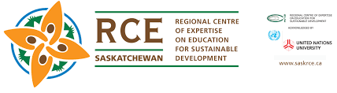

## Project Name: RCESaskAssistance 

## Team Members: 
* Eric Chartier

# About this Project:
This project aims to help the RCESaskatchewan community, a community that deals with trying to
educate the local region of Saskatchewan on sustainable development as it relates to the united nations’
17 goals for sustainable development. One component of educating people on sustainable development in
Saskatchewan is making them see that there is opportunity in Saskatchewan for sustainable development.
The way that is thought to do this is through displaying the sustainable development projects going on in
Saskatchewan that are recognized by RCESaskatchewan, as they do yearly a recognition award for
sustainable developments in the province. These projects can be displayed for visitors of the
RCESaskatchewan website to engage with.

# Business Need/ Opportunity

Since the community is expanding there may need help to make sure their community tools can expand to scale to accommodate the growing community with changing some points of interactions that may cause bottlenecks at a larger scale of community.
as well there may be opportunities to create solutions to help the community better serve its goals such as providing knowledge about sustainable development within saskatchewan.
Opportunity to help better represent the wide range of sustainability projects going on in saskatchewan 
Opportunity to help expand community outreach 

# What is found in this repository  
due to sestive information that this project deals with, no actual code files or WordPress back up will be present. what is found here are:
 
 * Documentation 
 * Demos
 * Solution initalization guides 
